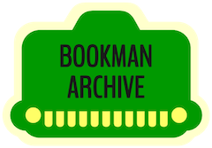

<table width="100%"><tr><td width="33%" valign="top"></td><td width="33%" valign="top">

- 🕵️ [Retro-reverse engineering: ROM dumper tool and binary analysis](https://github.com/bookmanarchive/rom-dumper)
- 🔓 [Reversing a CD key scheme to defeat a setup program](https://jsyang.ca/hacks/franklin-bookman-desktop-manager-cd-key-scheme-reversed/)
- 📚 [Bookman Archive: an ongoing digital archival project focused on an early ebook platform](https://bookmanarchive.com)

</td><td width="33%" valign="top">
    
- 🕹️ [Celestial Combat: a game of galactic conquest and colonization](https://jsyang.ca/celestial/) 
- 🔓 [Reverse engineering a Guitar Hero Live Bluetooth LE controller](https://jsyang.ca/hacks/ghliveble/)
- 🔓 [Reverse engineering a Gear VR Bluetooth controller](https://jsyang.ca/hacks/gear-vr-rev-eng/)

</td></tr></table>    
    
<!--
### Tools

The best tools are the ones fit to your needs and mine vary greatly:

- Full-stack Web dev mostly in the JS ecosystem
- Sysadmin / Ops / SRE type things are done in anything from shell scripts to Ansible to Terraform
- Embedded development in C and CPP; microcontroller stuff mostly in Arduino
- For retrocomputing, I'm happiest in a hex editor / disassembler / decompiler
- OpenSCAD for anything functionally 3D
-->
